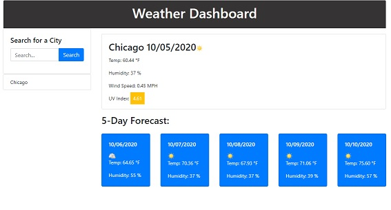

# Weather Dashboard

This application shows the weather of any city selected by the user. It's meant to be used by people who needs to get the weather on the go and plan for the future by giving you a forecast of the next 5 days. 

```
It gets the data from openweather API. It has images that shows the user the current weather condition.

The site stores data in local storage so the user can search through their search history. 
When the user open the app the last search is printed on the screen.
The UV color changes depending on current status.
```

The following image demonstrates the application functionality:



